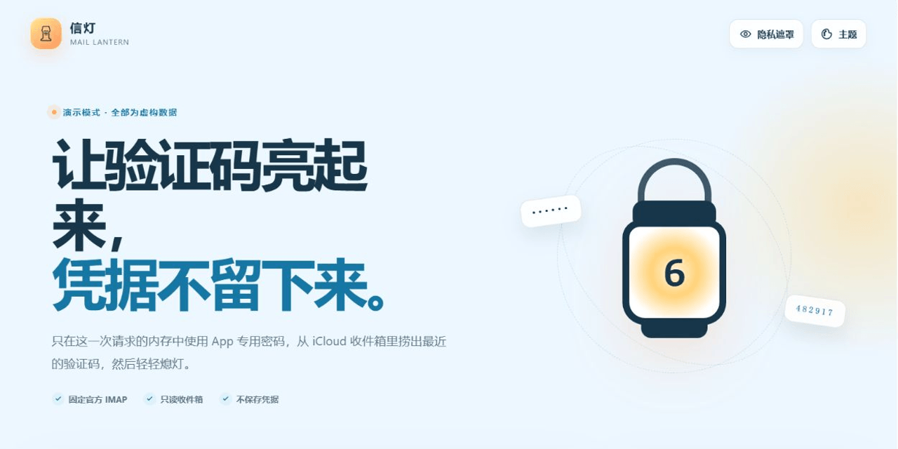

# 信灯 / Mail Lantern — iCloud 验证码查找

[](https://github.com/ferretgeek/MailLantern/releases)
[](https://github.com/ferretgeek/MailLantern/actions/workflows/ci.yml)
[](https://github.com/ferretgeek/MailLantern/actions/workflows/codeql.yml)
[](https://www.python.org/)
[](./LICENSE)

> 中文 · [English](./README_EN.md)


让验证码亮起来，凭据不留下来。信灯只读连接 Apple 公布的 iCloud IMAP，从最近邮件中找出验证码；App 专用密码仅在一次请求的内存中使用，结束即清空。

## 界面实景




## 它刻意只做这些

- 固定连接 `imap.mail.me.com:993`，使用系统 CA 验证 TLS。
- 以只读方式打开 `INBOX`，通过 `BODY.PEEK[]` 获取有限数量的最近邮件。
- 按时间和目标收件地址筛选，识别 4–8 位验证码。
- 返回验证码、主题、时间以及遮罩后的发件人与收件人。
- 提供晴空、青玉、晚霞和深灰四套全局主题，以及隐私遮罩和响应式界面。

它不会保存邮箱、密码、邮件或扫描结果；不会使用 Apple 登录密码、2FA、Cookie、令牌、私有 API、浏览器自动化或账号批量操作。

## 本地运行

需要 Python 3.10+。运行时只使用 Python 标准库。

```bash
python -m venv .venv
# Windows
.venv\Scripts\python -m pip install .
.venv\Scripts\mail-lantern
# macOS / Linux
.venv/bin/python -m pip install .
.venv/bin/mail-lantern
```

打开终端显示的、带临时 `#token=` 片段的网址。浏览器读取后会立即从地址栏移除令牌。

只看虚构数据的演示模式：

```bash
mail-lantern --demo
```

## 使用准备

1. 在 Apple 账户页面创建 **App 专用密码**，不要输入 Apple 登录密码。
2. 填写 iCloud 邮箱；如果只想查某个“隐藏邮件地址”或别名，可填写目标收件地址。
3. 选择邮件数量和时间范围，再开始扫描。

[Apple 官方：使用 App 专用密码](https://support.apple.com/102654)

## 部署与安全

本机默认只监听 `127.0.0.1:8769`。服务器部署必须保持应用监听回环地址，并通过 SSH 隧道或 HTTPS 反向代理访问；不要把明文 HTTP 直接暴露到公网。

- [部署教程](./docs/DEPLOYMENT.md)
- [隐私边界](./docs/PRIVACY.md)
- [架构说明](./docs/ARCHITECTURE.md)
- [安全报告](./SECURITY.md)

## 验证

```bash
python -m unittest discover -s tests -v
ruff check .
ruff format --check .
bandit -r src -ll
```

MIT License · [参与贡献](./CONTRIBUTING.md)
